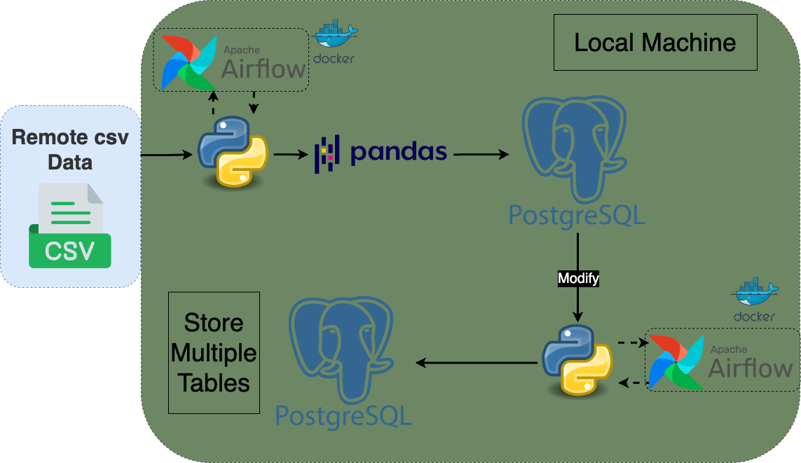

# End-to-End-Data-Engineering - DataFlow Harmony
In this data engineering project, the workflow involves retrieving a CSV file, creating a PostgreSQL table, manipulating data frames, and then writing the modified data frames back into the PostgreSQL database. The entire process is orchestrated using Apache Airflow, which is executed within a Docker container. Several Python libraries are used to facilitate the different steps in the pipeline.

# Architecture

